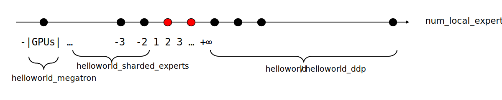

<p align="center">
  </a>
</p>

```sh
# Ex1 - helloworld/helloworld_ddp: running Standard MoE using 8 GPUs, with each GPU managing 2 experts:
$ mpiexec -host localhost -x LOCAL_SIZE=8 python3 -m tutel.launcher.run -m tutel.examples.helloworld --batch_size=16 --num_local_experts=2

# Ex2 - helloworld_sharded_experts: running MoE with shared expert slices using 8 GPUs, with each expert managed by 2 GPUs:
$ mpiexec -host localhost -x LOCAL_SIZE=8 python3 -m tutel.launcher.run -m tutel.examples.helloworld --batch_size=16 --num_local_experts=-2

# Ex3 - helloworld_megatron: running Dense FFN using 8 GPUs, with all 8 GPUs managing a unique expert:
$ mpiexec -host localhost -x LOCAL_SIZE=8 python3 -m tutel.launcher.run -m tutel.examples.helloworld --batch_size=16 --num_local_experts=-8

```
